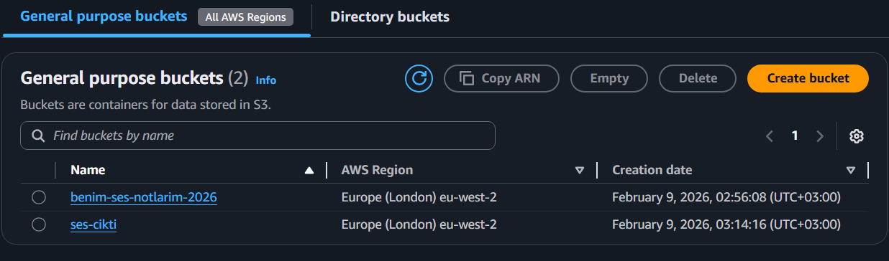
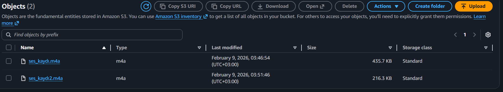
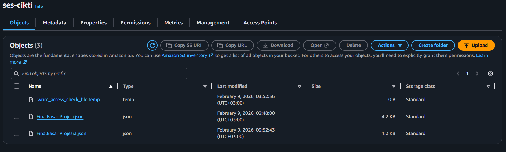
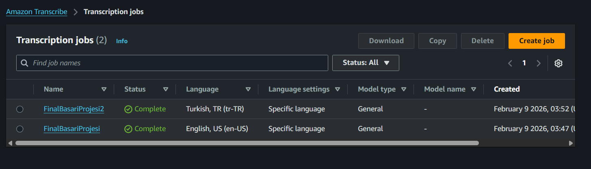
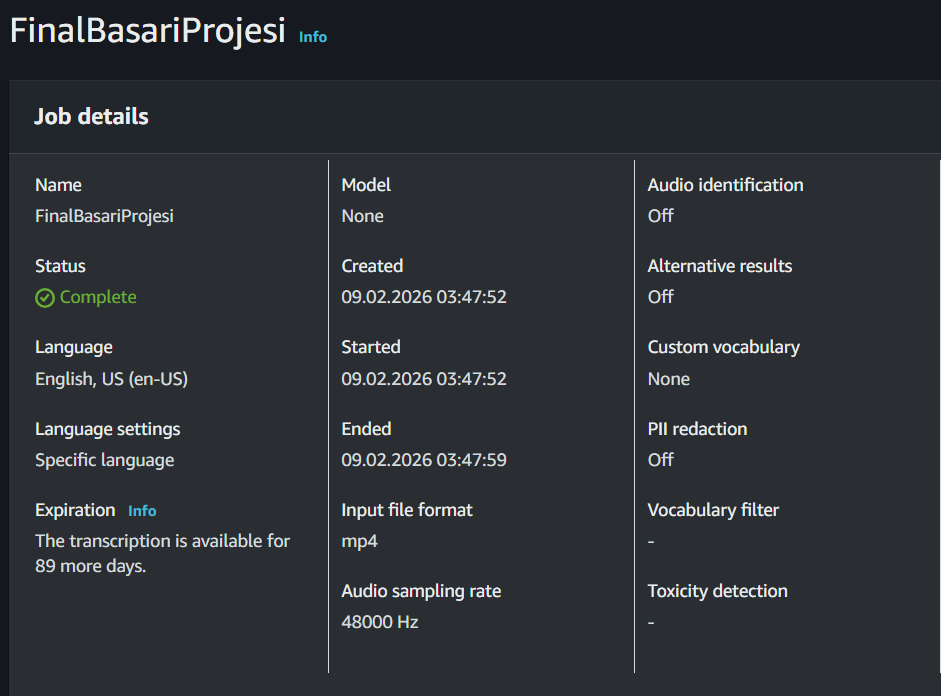
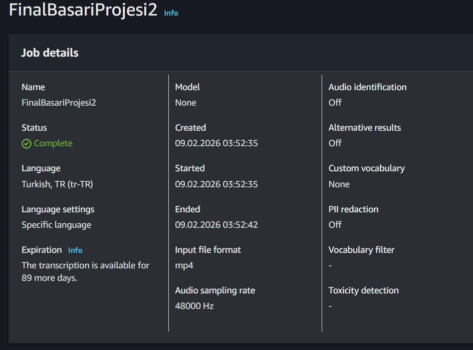

# AWS AI ile Sesli Notları Metne Dönüştürme Projesi

## Proje Mimarisi
Bu sistem, AWS'nin bulut yerli (cloud-native) servislerini kullanarak şu akışı takip eder:
**Ses Yükleme (S3)** ➔ **Yapay Zeka İşleme (Amazon Transcribe)** ➔ **Metin Çıktısı (S3)**

## Teknik Özellikler
* **Servis Entegrasyonu:** Verilerin güvenli depolanması için **Amazon S3**, ses analizi ve doğal dil işleme (NLP) için **Amazon Transcribe** kullanılmıştır.
* **Sorun Giderme (Troubleshooting):** İlk aşamada karşılaşılan `.aac` formatındaki kodek uyumsuzluğu sorunu, dosyalar `.mp3` formatına optimize edilerek ve standart Transcribe iş akışı uygulanarak çözülmüştür.
* **Dil Desteği:** Projede yüksek doğruluk oranına sahip **Türkçe (tr-TR)** dil tanımlama modeli kullanılmıştır.

## Proje Çıktıları
* **Giriş Verisi:** S3 üzerinde depolanan ses dosyası.
* **Çıktı Verisi:** [output.json](./output.json) (Zaman damgalı ve metne dökülmüş verileri içerir).

## 📸 Uygulama Kanıtı

